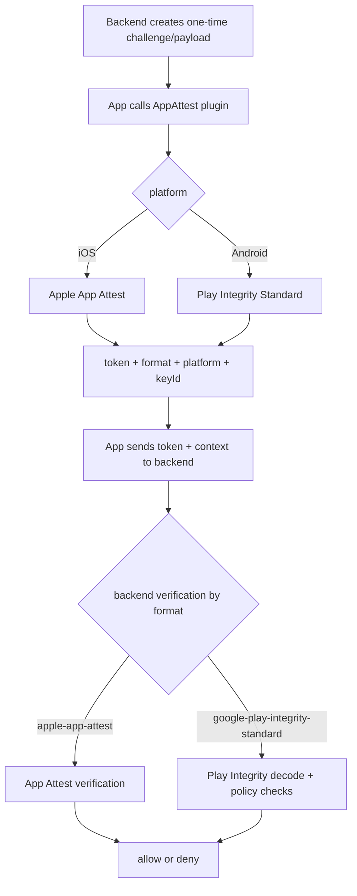
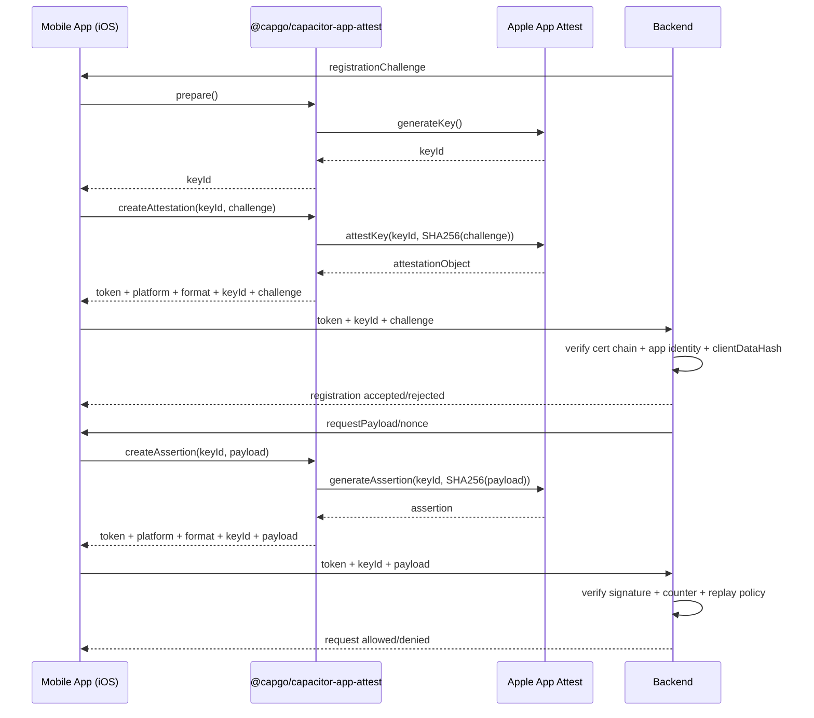
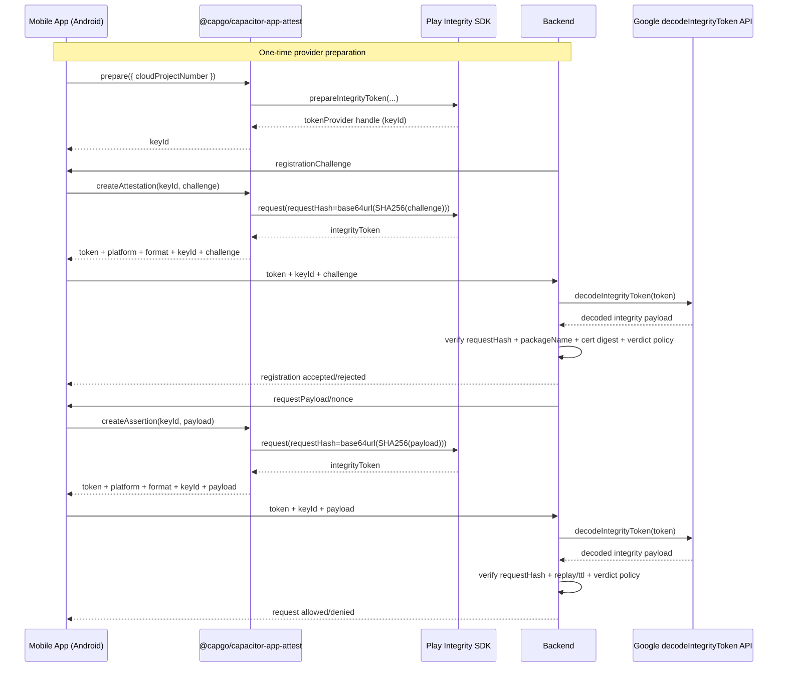

# @capgo/capacitor-app-attest
 <a href="https://capgo.app/"></a>

<div align="center">
  <h2><a href="https://capgo.app/?ref=plugin_app_attest"> ➡️ Get Instant updates for your App with Capgo</a></h2>
  <h2><a href="https://capgo.app/consulting/?ref=plugin_app_attest"> Missing a feature? We’ll build the plugin for you 💪</a></h2>
</div>

Cross-platform device attestation for Capacitor:
- iOS: Apple App Attest (`DeviceCheck`)
- Android: Google Play Integrity Standard API token attestation

## Why this plugin

This plugin gives you one JavaScript API for both platforms while using only the native attestation systems:

- iOS uses Apple App Attest.
- Android uses Google Play Integrity Standard API.
- No custom cryptography, no random app-side security scheme.
- Same JS methods and same output shape on both platforms (`platform`, `format`, `token`, `keyId`).

Use it to harden login, account recovery, payments, promo abuse checks, and other high-risk endpoints.

## Security model

Attestation only adds value when validated on your backend.

- Never trust client-side success alone.
- Always verify App Attest / Play Integrity payloads server-side.
- Reject tokens/assertions that fail signature, nonce, app identity, or environment checks.

## Unified API design

Recommended JS API:

- `prepare()`
- `createAttestation()`
- `createAssertion()`

Legacy aliases are still available for compatibility:

- `generateKey()` => `prepare()`
- `attestKey()` => `createAttestation()`
- `generateAssertion()` => `createAssertion()`

On both iOS and Android, results include:

- `platform`: `ios` or `android`
- `format`: `apple-app-attest` or `google-play-integrity-standard`
- `token`: normalized token field for backend verification

## Documentation

The most complete doc is available here: https://capgo.app/docs/plugins/app-attest/

## Compatibility

| Plugin version | Capacitor compatibility | Maintained |
| -------------- | ----------------------- | ---------- |
| v8.*.*         | v8.*.*                  | ✅          |
| v7.*.*         | v7.*.*                  | On demand  |
| v6.*.*         | v6.*.*                  | ❌          |
| v5.*.*         | v5.*.*                  | ❌          |

> **Note:** The major version of this plugin follows the major version of Capacitor. Use the version that matches your Capacitor installation (for example, plugin v8 for Capacitor 8).

## Install (Capacitor 8)

```bash
bun add @capgo/capacitor-app-attest
bunx cap sync
```

## Platform setup

### iOS

1. Open your app target in Xcode.
2. Enable the `App Attest` capability (under `Signing & Capabilities`).
3. Run on a physical device (App Attest is not available in all simulator contexts).

### Android

1. Enable **Play Integrity API** in your Google Cloud project.
2. In Play Console, configure integrity access for your app.
3. Set `cloudProjectNumber` in Capacitor config:

```ts
// capacitor.config.ts
plugins: {
  AppAttest: {
    cloudProjectNumber: '123456789012'
  }
}
```

You can also pass `cloudProjectNumber` directly in method options.
This plugin uses the **Standard Integrity API** flow on Android (`prepareIntegrityToken` + `request`).
On Android, `prepare()` prepares the native Standard Integrity provider and returns a handle (`keyId`) for subsequent calls.

## Usage

```ts
import { AppAttest } from '@capgo/capacitor-app-attest';

const support = await AppAttest.isSupported();
if (!support.isSupported) {
  return;
}

const prepared = await AppAttest.prepare();
const keyId = prepared.keyId;

const registration = await AppAttest.createAttestation({
  keyId,
  challenge: 'server-registration-challenge',
});

const assertion = await AppAttest.createAssertion({
  keyId,
  payload: 'request-payload-or-nonce-from-backend',
});

// registration.token and assertion.token are verified server-side.
console.log(registration, assertion);
```

## Backend handling

Your backend must branch by `platform`/`format` and run the native verification flow for that platform.

### iOS backend (Apple App Attest)

Registration (`createAttestation`):

1. Generate a one-time random challenge on your backend.
2. Send that challenge to the app.
3. App calls `prepare()` once, then `createAttestation({ keyId, challenge })`.
4. Backend verifies attestation with Apple App Attest rules:
   - Certificate chain is valid and anchored to Apple App Attest.
   - App identity matches your bundle/team.
   - `clientDataHash` corresponds to `SHA256(challenge)`.
5. Store key material state for this device/user (`keyId`, public key, counter metadata from your verifier).

Request protection (`createAssertion`):

1. Backend builds a per-request one-time payload/nonce (or canonical request hash input).
2. App calls `createAssertion({ keyId, payload })`.
3. Backend verifies assertion signature using the stored iOS App Attest key context.
4. Enforce replay protection (single-use nonce + expiration + monotonic counter checks from verifier output).

### Android backend (Play Integrity Standard API)

Registration (`createAttestation`):

1. Generate a one-time random challenge on your backend.
2. App calls `createAttestation({ keyId, challenge })`.
3. Backend decodes the returned Play Integrity token with Google Play Integrity server API (`decodeIntegrityToken`).
4. Validate at minimum:
   - `requestDetails.requestHash` equals `base64url(SHA256(challenge))`.
   - `appIntegrity.packageName` matches your app id.
   - `appIntegrity.certificateSha256Digest` contains your release signing cert digest.
   - `appIntegrity.appRecognitionVerdict` meets your policy (commonly `PLAY_RECOGNIZED`).
   - `deviceIntegrity.deviceRecognitionVerdict` meets your policy (for example includes `MEETS_DEVICE_INTEGRITY`).
5. Persist attestation decision/state tied to user/device session.

Request protection (`createAssertion`):

1. Backend issues a one-time request payload/nonce.
2. App calls `createAssertion({ keyId, payload })`.
3. Backend decodes token and checks `requestHash === base64url(SHA256(payload))`.
4. Reject reused/expired payloads and enforce your integrity verdict policy.

## Workflow schemas

### Unified cross-platform flow



### iOS workflow schema (registration + assertion)



### Android workflow schema (registration + assertion)



### Suggested backend payload contract

Registration payload from app to backend:

```json
{
  "platform": "ios | android",
  "format": "apple-app-attest | google-play-integrity-standard",
  "keyId": "string",
  "challenge": "string",
  "token": "string"
}
```

Assertion payload from app to backend:

```json
{
  "platform": "ios | android",
  "format": "apple-app-attest | google-play-integrity-standard",
  "keyId": "string",
  "payload": "string",
  "token": "string"
}
```

## Important backend notes

- Attestation challenges/payloads must be generated server-side.
- Treat every challenge/payload as single-use with short TTL.
- Keep allowlists for package id and cert digest by environment (dev/staging/prod).
- Log verification failures with reason codes; never silently accept failures.
- Do not use this plugin as a replacement for auth/session controls, use it as an additional trust signal.

## API

<docgen-index>

* [`isSupported()`](#issupported)
* [`prepare(...)`](#prepare)
* [`createAttestation(...)`](#createattestation)
* [`createAssertion(...)`](#createassertion)
* [`storeKeyId(...)`](#storekeyid)
* [`getStoredKeyId()`](#getstoredkeyid)
* [`clearStoredKeyId()`](#clearstoredkeyid)
* [`generateKey(...)`](#generatekey)
* [`attestKey(...)`](#attestkey)
* [`generateAssertion(...)`](#generateassertion)
* [Interfaces](#interfaces)
* [Type Aliases](#type-aliases)

</docgen-index>

<docgen-api>
<!--Update the source file JSDoc comments and rerun docgen to update the docs below-->

Unified cross-platform attestation plugin for Capacitor.

Recommended methods:
- `prepare()`
- `createAttestation()`
- `createAssertion()`

Legacy aliases are still available for compatibility:
- `generateKey()`
- `attestKey()`
- `generateAssertion()`

### isSupported()

```typescript
isSupported() => Promise<IsSupportedResult>
```

Checks whether native attestation is available on this device.

**Returns:** <code>Promise&lt;<a href="#issupportedresult">IsSupportedResult</a>&gt;</code>

--------------------


### prepare(...)

```typescript
prepare(options?: PrepareOptions | undefined) => Promise<PrepareResult>
```

Prepares attestation state and returns the key handle used for later calls.

iOS: generates a real App Attest key identifier.
Android: prepares a Play Integrity Standard token provider handle.

| Param         | Type                                                      |
| ------------- | --------------------------------------------------------- |
| **`options`** | <code><a href="#prepareoptions">PrepareOptions</a></code> |

**Returns:** <code>Promise&lt;<a href="#prepareresult">PrepareResult</a>&gt;</code>

--------------------


### createAttestation(...)

```typescript
createAttestation(options: CreateAttestationOptions) => Promise<CreateAttestationResult>
```

Creates a registration attestation token bound to a backend-issued challenge.

iOS: returns App Attest `attestationObject`.
Android: returns Play Integrity Standard token.

| Param         | Type                                                                          |
| ------------- | ----------------------------------------------------------------------------- |
| **`options`** | <code><a href="#createattestationoptions">CreateAttestationOptions</a></code> |

**Returns:** <code>Promise&lt;<a href="#createattestationresult">CreateAttestationResult</a>&gt;</code>

--------------------


### createAssertion(...)

```typescript
createAssertion(options: CreateAssertionOptions) => Promise<CreateAssertionResult>
```

Creates a request assertion token bound to a request payload.

iOS: returns App Attest assertion.
Android: returns Play Integrity Standard token.

| Param         | Type                                                                      |
| ------------- | ------------------------------------------------------------------------- |
| **`options`** | <code><a href="#createassertionoptions">CreateAssertionOptions</a></code> |

**Returns:** <code>Promise&lt;<a href="#createassertionresult">CreateAssertionResult</a>&gt;</code>

--------------------


### storeKeyId(...)

```typescript
storeKeyId(options: StoreKeyIdOptions) => Promise<OperationResult>
```

Stores/prepares a key identifier for reuse.

iOS: persists in UserDefaults.
Android: prepares a native Play Integrity provider for this key id in memory (process lifetime).

| Param         | Type                                                            |
| ------------- | --------------------------------------------------------------- |
| **`options`** | <code><a href="#storekeyidoptions">StoreKeyIdOptions</a></code> |

**Returns:** <code>Promise&lt;<a href="#operationresult">OperationResult</a>&gt;</code>

--------------------


### getStoredKeyId()

```typescript
getStoredKeyId() => Promise<GetStoredKeyIdResult>
```

Returns the currently stored/prepared key identifier.

Android value is only available while the process is alive.

**Returns:** <code>Promise&lt;<a href="#getstoredkeyidresult">GetStoredKeyIdResult</a>&gt;</code>

--------------------


### clearStoredKeyId()

```typescript
clearStoredKeyId() => Promise<OperationResult>
```

Clears stored/prepared key identifiers.

**Returns:** <code>Promise&lt;<a href="#operationresult">OperationResult</a>&gt;</code>

--------------------


### generateKey(...)

```typescript
generateKey(options?: PrepareOptions | undefined) => Promise<GenerateKeyResult>
```

Legacy alias for `prepare()`.

| Param         | Type                                                      |
| ------------- | --------------------------------------------------------- |
| **`options`** | <code><a href="#prepareoptions">PrepareOptions</a></code> |

**Returns:** <code>Promise&lt;<a href="#prepareresult">PrepareResult</a>&gt;</code>

--------------------


### attestKey(...)

```typescript
attestKey(options: AttestKeyOptions) => Promise<AttestKeyResult>
```

Legacy alias for `createAttestation()`.

| Param         | Type                                                                          |
| ------------- | ----------------------------------------------------------------------------- |
| **`options`** | <code><a href="#createattestationoptions">CreateAttestationOptions</a></code> |

**Returns:** <code>Promise&lt;<a href="#attestkeyresult">AttestKeyResult</a>&gt;</code>

--------------------


### generateAssertion(...)

```typescript
generateAssertion(options: GenerateAssertionOptions) => Promise<GenerateAssertionResult>
```

Legacy alias for `createAssertion()`.

| Param         | Type                                                                      |
| ------------- | ------------------------------------------------------------------------- |
| **`options`** | <code><a href="#createassertionoptions">CreateAssertionOptions</a></code> |

**Returns:** <code>Promise&lt;<a href="#generateassertionresult">GenerateAssertionResult</a>&gt;</code>

--------------------


### Interfaces


#### IsSupportedResult

| Prop              | Type                                                                |
| ----------------- | ------------------------------------------------------------------- |
| **`isSupported`** | <code>boolean</code>                                                |
| **`platform`**    | <code><a href="#attestationplatform">AttestationPlatform</a></code> |
| **`format`**      | <code><a href="#attestationformat">AttestationFormat</a></code>     |


#### PrepareResult

| Prop           | Type                                                                |
| -------------- | ------------------------------------------------------------------- |
| **`keyId`**    | <code>string</code>                                                 |
| **`platform`** | <code><a href="#attestationplatform">AttestationPlatform</a></code> |
| **`format`**   | <code><a href="#attestationformat">AttestationFormat</a></code>     |


#### PrepareOptions

| Prop                     | Type                | Description                                                                                                                                       |
| ------------------------ | ------------------- | ------------------------------------------------------------------------------------------------------------------------------------------------- |
| **`cloudProjectNumber`** | <code>string</code> | Android only. Google Cloud project number for Play Integrity. Can be set globally in Capacitor config via `plugins.AppAttest.cloudProjectNumber`. |


#### CreateAttestationResult

| Prop            | Type                                                                | Description                                                                                         |
| --------------- | ------------------------------------------------------------------- | --------------------------------------------------------------------------------------------------- |
| **`token`**     | <code>string</code>                                                 | Unified attestation token value. iOS: base64 App Attest attestation. Android: Play Integrity token. |
| **`keyId`**     | <code>string</code>                                                 |                                                                                                     |
| **`challenge`** | <code>string</code>                                                 |                                                                                                     |
| **`platform`**  | <code><a href="#attestationplatform">AttestationPlatform</a></code> |                                                                                                     |
| **`format`**    | <code><a href="#attestationformat">AttestationFormat</a></code>     |                                                                                                     |


#### CreateAttestationOptions

| Prop                     | Type                |
| ------------------------ | ------------------- |
| **`keyId`**              | <code>string</code> |
| **`challenge`**          | <code>string</code> |
| **`cloudProjectNumber`** | <code>string</code> |


#### CreateAssertionResult

| Prop           | Type                                                                | Description                                                                                     |
| -------------- | ------------------------------------------------------------------- | ----------------------------------------------------------------------------------------------- |
| **`token`**    | <code>string</code>                                                 | Unified assertion token value. iOS: base64 App Attest assertion. Android: Play Integrity token. |
| **`keyId`**    | <code>string</code>                                                 |                                                                                                 |
| **`payload`**  | <code>string</code>                                                 |                                                                                                 |
| **`platform`** | <code><a href="#attestationplatform">AttestationPlatform</a></code> |                                                                                                 |
| **`format`**   | <code><a href="#attestationformat">AttestationFormat</a></code>     |                                                                                                 |


#### CreateAssertionOptions

| Prop                     | Type                |
| ------------------------ | ------------------- |
| **`keyId`**              | <code>string</code> |
| **`payload`**            | <code>string</code> |
| **`cloudProjectNumber`** | <code>string</code> |


#### OperationResult

| Prop          | Type                 |
| ------------- | -------------------- |
| **`success`** | <code>boolean</code> |


#### StoreKeyIdOptions

| Prop                     | Type                |
| ------------------------ | ------------------- |
| **`keyId`**              | <code>string</code> |
| **`cloudProjectNumber`** | <code>string</code> |


#### GetStoredKeyIdResult

| Prop               | Type                        |
| ------------------ | --------------------------- |
| **`keyId`**        | <code>string \| null</code> |
| **`hasStoredKey`** | <code>boolean</code>        |


#### AttestKeyResult

| Prop              | Type                | Description                    |
| ----------------- | ------------------- | ------------------------------ |
| **`attestation`** | <code>string</code> | Legacy field equal to `token`. |


#### GenerateAssertionResult

| Prop            | Type                | Description                    |
| --------------- | ------------------- | ------------------------------ |
| **`assertion`** | <code>string</code> | Legacy field equal to `token`. |


### Type Aliases


#### AttestationPlatform

<code>'ios' | 'android' | 'web'</code>


#### AttestationFormat

<code>'apple-app-attest' | 'google-play-integrity-standard' | 'web-fallback'</code>


#### GenerateKeyOptions

<code><a href="#prepareoptions">PrepareOptions</a></code>


#### GenerateKeyResult

<code><a href="#prepareresult">PrepareResult</a></code>


#### AttestKeyOptions

<code><a href="#createattestationoptions">CreateAttestationOptions</a></code>


#### GenerateAssertionOptions

<code><a href="#createassertionoptions">CreateAssertionOptions</a></code>

</docgen-api>

## Credits

iOS App Attest flow is inspired by the original plugin from `ludufre/capacitor-app-attest`.
Android support in this plugin is implemented with Google Play Integrity to provide equivalent attestation coverage.
